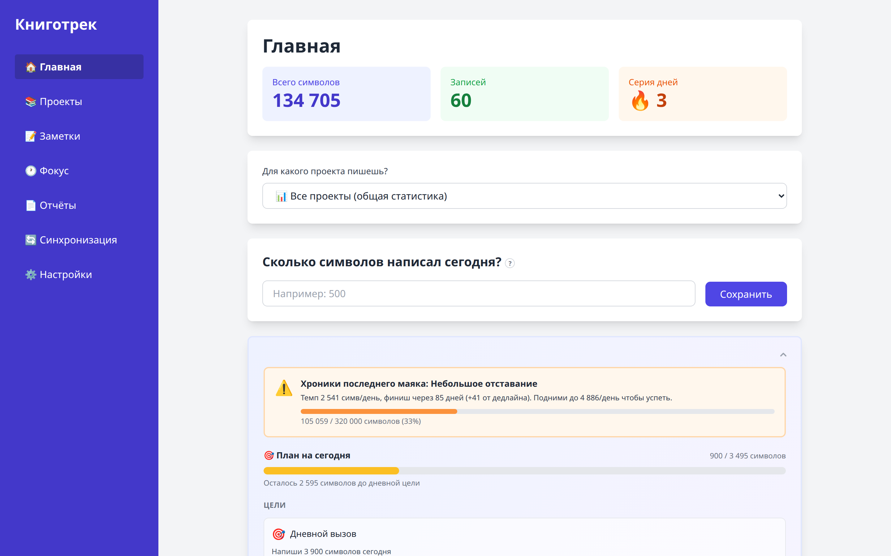
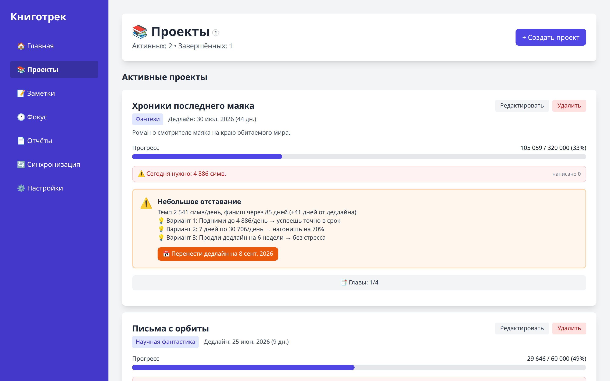
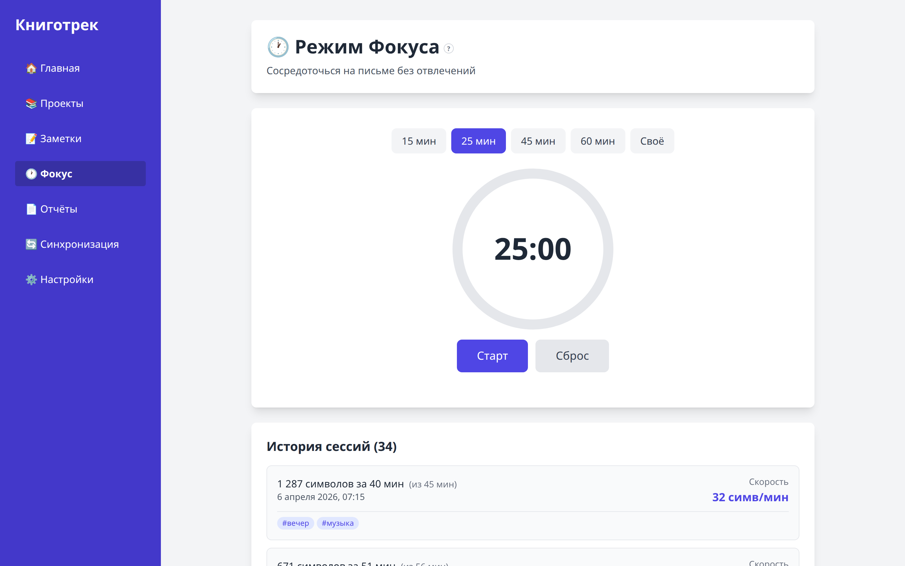
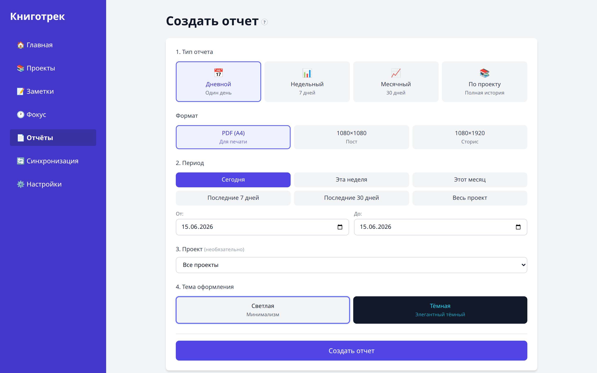

# 📚 Книготрек

**Русский** · [English](README.en.md)

**Бесплатный десктоп-трекер прогресса для писателей.** Отслеживайте написанное, ставьте цели, анализируйте привычки, генерируйте PDF-отчёты и работайте в режиме фокуса — всё локально на вашем компьютере.

[](./LICENSE)

> Книготрек — проект с открытым исходным кодом. Все функции бесплатны, без подписок и ограничений. Если приложение окажется вам полезным, поддержать его развитие можно по желанию — см. [ниже](#-поддержать-проект).

## 🔒 Приватность

Книготрек **не отправляет ваши данные никуда** — всё хранится локально на устройстве (SQLite в десктопе, localStorage в браузере). Приложение трекает только **метаданные** (числа, время, теги) и **никогда не просит и не хранит текст вашей книги**. Нет аккаунтов, нет трекинга, нет облака по умолчанию. Синхронизацию между устройствами можно при желании подключить через свой Supabase (см. ниже).

## Возможности

- **Трекинг прогресса** — символы, дни, streak, графики, календарь активности
- **Проекты** — книги, жанры, дедлайны, статусы, неограниченное количество
- **Цели и челленджи** — дневные/проектные цели с прогрессом
- **Режим фокуса** — таймер для продуктивного письма с учётом написанного
- **Заметки и идеи**
- **PDF-отчёты** — дневной, недельный, месячный, проектный, итоги года и др.
- **Умный ассистент** — советы, прогноз сроков, аналитика по тегам и времени
- **Достижения и рекорды**
- **Экспорт в соцсети** — картинки и PDF для публикаций
- **Тёмная тема**, локальные уведомления, резервные копии БД
- **Опциональная облачная синхронизация** между устройствами (см. ниже)
- **Двуязычный интерфейс** (русский / English) и подсказки «?» у разделов

## 📸 Как это выглядит

| Главная — прогресс, серия дней, прогноз финиша | Проекты — дедлайны, главы, темп |
|:---:|:---:|
|  |  |
| **Режим фокуса** — таймер и история сессий | **Отчёты** — PDF и картинки |
|  |  |

## 📦 Установка (рекомендуемый способ)

> ⚠️ **Скачивайте Книготрек только из официального репозитория** — со страницы [Releases](https://github.com/litsos629/knigotrek/releases) этого проекта на GitHub. За безопасность копий, выложенных на сторонних сайтах, мы не отвечаем.

Командная строка не нужна. Скачайте готовую сборку для своей системы со страницы
**[Releases](https://github.com/litsos629/knigotrek/releases)** и установите как обычную программу:

| Система | Файл | Что делать |
|---|---|---|
| **Windows** | `knigotrek-…-win-x64.exe` | Запустить установщик — появятся ярлыки на рабочем столе и в меню «Пуск» |
| **macOS** | `knigotrek-…-mac.dmg` | Открыть и перетащить Книготрек в «Программы» |
| **Linux** | `knigotrek-…-linux-x64.AppImage` | Сделать файл исполняемым и запустить (или `.deb` для Ubuntu/Debian) |

> 💡 **При первом запуске система может предупредить о «неизвестном издателе».** Приложение не подписано платным сертификатом — это нормально для бесплатных open-source программ (код открыт, можно проверить):
> - **Windows:** «Windows защитила ваш компьютер» → **Подробнее** → **Выполнить в любом случае**.
> - **macOS:** правый клик по приложению → **Открыть** → **Открыть**.

## Запуск из исходников (для разработчиков)

```bash
# Установка зависимостей
npm install

# Десктопное приложение (Electron) — основной режим
npm run electron:dev

# Веб-версия в браузере (данные в localStorage)
npm run dev

# Тесты
npm test
```

Требования: **Node.js 18+**, **npm 9+**.

## Сборка десктопного приложения

```bash
npm run dist:win    # Windows (.exe / portable)
npm run dist:mac    # macOS (.dmg)
npm run dist:linux  # Linux (.AppImage / .deb)
```

Готовые сборки появятся в каталоге `release/`.

## Облачная синхронизация (опционально)

По умолчанию все данные хранятся **локально** (SQLite в десктопе, localStorage в браузере) и никуда не отправляются.

Если нужна синхронизация между устройствами, можно подключить свой бесплатный проект [Supabase](https://supabase.com):

1. Скопируйте `.env.example` в `.env`
2. Впишите `VITE_SUPABASE_URL` и `VITE_SUPABASE_ANON_KEY` из вашего проекта Supabase
3. Создайте таблицы в Supabase (SQL Editor → вставьте схему ниже → Run)
4. Перезапустите приложение — вкладка «Данные и синхронизация» станет активной

Без этих переменных синхронизация просто неактивна, остальное работает как обычно. Функция помечена как **бета**.

<details>
<summary><b>SQL-схема для Supabase (развернуть)</b></summary>

```sql
create table if not exists sync_entries (
  user_id uuid references auth.users not null,
  sync_id uuid not null,
  date text not null,
  symbols integer not null default 0,
  deleted integer not null default 0,
  project_id text,
  created_at timestamptz,
  updated_at timestamptz not null default now(),
  primary key (user_id, sync_id)
);

create table if not exists sync_projects (
  user_id uuid references auth.users not null,
  id text not null,
  title text not null,
  genre text,
  target_symbols integer default 0,
  deadline text,
  status text,
  phase text default 'draft',
  start_date text,
  completed_date text,
  description text,
  unfreeze_count integer default 0,
  is_hidden boolean default false,
  created_at timestamptz,
  updated_at timestamptz not null default now(),
  primary key (user_id, id)
);

create table if not exists sync_chapters (
  user_id uuid references auth.users not null,
  id text not null,
  project_id text,
  title text not null,
  status text default 'planned',
  position integer default 0,
  created_at timestamptz,
  updated_at timestamptz not null default now(),
  primary key (user_id, id)
);

create table if not exists sync_sessions (
  user_id uuid references auth.users not null,
  id text not null,
  date text not null,
  duration integer default 0,
  planned_duration integer default 0,
  symbols integer default 0,
  speed integer default 0,
  mood text,
  tags text,
  note text,
  project_id text,
  created_at timestamptz,
  updated_at timestamptz not null default now(),
  primary key (user_id, id)
);

create table if not exists sync_notes (
  user_id uuid references auth.users not null,
  id text not null,
  title text not null,
  content text,
  date text,
  updated_at timestamptz not null default now(),
  primary key (user_id, id)
);

create table if not exists sync_settings (
  user_id uuid references auth.users not null,
  key text not null,
  value text,
  updated_at timestamptz not null default now(),
  primary key (user_id, key)
);

-- Доступ только к своим строкам
alter table sync_entries enable row level security;
alter table sync_projects enable row level security;
alter table sync_chapters enable row level security;
alter table sync_sessions enable row level security;
alter table sync_notes enable row level security;
alter table sync_settings enable row level security;

create policy "own rows" on sync_entries for all using (auth.uid() = user_id) with check (auth.uid() = user_id);
create policy "own rows" on sync_projects for all using (auth.uid() = user_id) with check (auth.uid() = user_id);
create policy "own rows" on sync_chapters for all using (auth.uid() = user_id) with check (auth.uid() = user_id);
create policy "own rows" on sync_sessions for all using (auth.uid() = user_id) with check (auth.uid() = user_id);
create policy "own rows" on sync_notes for all using (auth.uid() = user_id) with check (auth.uid() = user_id);
create policy "own rows" on sync_settings for all using (auth.uid() = user_id) with check (auth.uid() = user_id);
```

</details>

## Технологии

- **React 19** + **TypeScript**
- **Vite** — сборка
- **Tailwind CSS** — стили
- **Electron** — десктопная оболочка
- **SQLite** (better-sqlite3) — локальная база данных
- **Vitest** — тесты
- **Supabase** — опциональная синхронизация

## ❤️ Поддержать проект

Книготрек бесплатный и развивается в свободное время. Если он вам пригодился:

- ⭐ [**Поставьте звезду**](https://github.com/litsos629/knigotrek) репозиторию — это лучшая и полностью бесплатная поддержка

## 💬 Обратная связь

Нашли баг, что-то работает не так, есть идея или просто хотите сказать, что зашло (или не зашло)? Пишите в **[Issues](https://github.com/litsos629/knigotrek/issues)** — это лучший способ помочь проекту. Любой отзыв ценен: что починить, чего не хватает, что понравилось.

## Вклад в проект

Баг-репорты, идеи и pull request'ы приветствуются. Перед крупными изменениями лучше сначала открыть issue для обсуждения.

```bash
npm install        # установка
npm test           # тесты должны проходить
npm run type-check # проверка типов
```

## Лицензия

[MIT](./LICENSE) © litsos629
